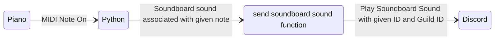

# discord piano soundboard

```mermaid
stateDiagram-v2
    direction LR
    Piano --> Python: MIDI Note On
    pf: send soundboard sound function
    Python --> pf: Soundboard sound associated with given note<br/><br/>
    pf --> Discord: Play Soundboard Sound with given ID and Guild ID<br/><br/>
```
