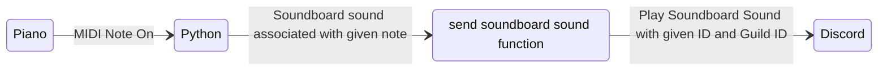

# discord piano soundboard

## What you need
- Requirements from (requirements.txt)
- `sounddb.json` in the form `{"note name": ["sound id", "guild id"]}` where note names can be seen [here](https://github.com/mugman174/piano-soundboard/blob/db855f3ce11d6cf6d152fd5565ea88c2d0e10754/bot.py#L46-L51).
- A MIDI keyboard device that connects to your computer and sends Note On events
- `config.py`
    - `MIDI_DEVICE_NAME`
        - can be found with `mido.get_output_names()`
    - `TOKENS`
        - list of Discord bot tokens (just one will suffice)
    - `GUILD`
        - guild id
    - `OWNER`
        - owner id
